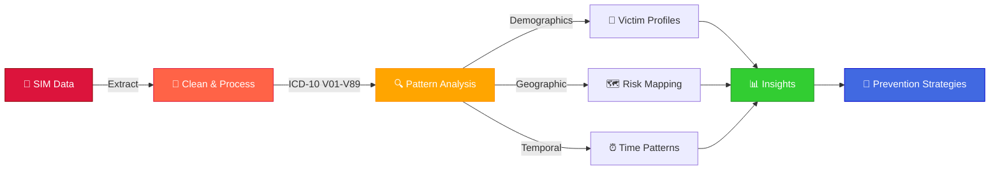
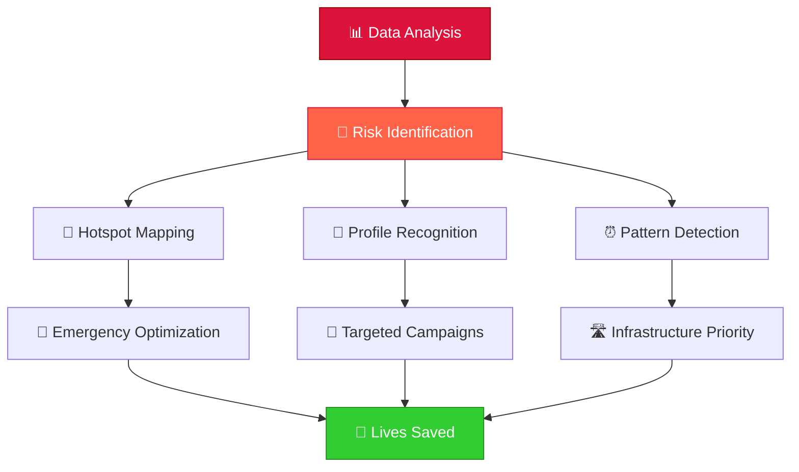

<!-- Hero Section -->
<div align="center">


<br><br>


<br>

**Advanced epidemiological analysis transforming mortality data into life-saving insights**

[💔 The Crisis](#-the-human-cost) • [🗺️ Discoveries](#️-key-discoveries) • [🛠️ Technologies](#️-technologies) • [📊 Insights](#-critical-insights) • [🚀 Impact](#-real-world-impact)

</div>

---


<!-- Project Overview -->
## 💡 **When Data Becomes a Lifeline**

<table>
<tr>
<td width="60%">

### 🎯 **The Mission**

What started as **Module 2's final assignment** evolved into an **urgent call for action.**

This project analyzes **traffic mortality data** from Espírito Santo (Brazil) to uncover patterns, identify risk factors, and propose **evidence-based prevention strategies** that can save lives.

> *"Behind every statistic lies a story cut short, a family forever changed. This analysis illuminates the path toward prevention, turning data into a beacon of hope for safer tomorrows."*

**Key Question:** *What if we could predict where the next tragedy might strike?*

</td>
<td width="40%">


</td>
</tr>
</table>


<!-- The Crisis -->
## 💔 **The Human Cost**

<div align="center">

### **The Silent Epidemic**

<table>
<tr>
<td align="center" width="25%">

### 📊 **Period**


Comprehensive analysis of mortality patterns

</td>
<td align="center" width="25%">

### 👥 **Victims**


Prime of life, economically active citizens

</td>
<td align="center" width="25%">

### 🗺️ **Hotspots**


Geographic patterns revealed through data

</td>
<td align="center" width="25%">

### ⏰ **Patterns**


Temporal trends showing when disasters strike

</td>
</tr>
</table>

</div>

### 🚨 **The Stark Reality**

<table>
<tr>
<td width="50%">

#### **What We're Losing**
- 🏥 **Healthcare System Strain**: Overwhelming emergency services
- 💰 **Economic Impact**: Loss of productive workforce
- 👨‍👩‍👧‍👦 **Family Devastation**: Countless lives forever changed
- 🏛️ **Social Cost**: Communities scarred by preventable tragedies

</td>
<td width="50%">

#### **What We Can Gain**
- 📍 **Targeted Prevention**: Data-driven intervention zones
- 🚨 **Optimized Response**: Strategic emergency deployment
- 📢 **Effective Campaigns**: Evidence-based awareness programs
- 🛣️ **Infrastructure Priorities**: Smart resource allocation

</td>
</tr>
</table>


<!-- Key Discoveries -->
## 🗺️ **Key Discoveries**

<div align="center">

### **Uncovering Patterns in Tragedy**

</div>

### 📊 **Analytical Framework**



### 🎯 **Three Pillars of Analysis**

<table>
<tr>
<td width="33%" align="center">

### 👤 **Demographics**

**Who are we losing?**

- 💍 Marital status patterns
- 👨‍💼 Age distribution analysis
- 📈 Risk factor identification
- 🎯 Vulnerable population profiles

</td>
<td width="33%" align="center">

### 🗺️ **Geography**

**Where do tragedies occur?**

- 📍 Municipal hotspot mapping
- 🛣️ Dangerous road corridors
- 🏥 Emergency response gaps
- 📊 Resource allocation priorities

</td>
<td width="33%" align="center">

### ⏰ **Temporal**

**When do disasters strike?**

- 📅 Seasonal vulnerability peaks
- 🎄 Holiday month spikes
- ⏱️ Hour-by-hour risk analysis
- 📉 Trend identification

</td>
</tr>
</table>


<!-- Technologies -->
## 🛠️ **Technologies**

<div align="center">

### **Data Science Arsenal**

<table>
<tr>
<td align="center" width="20%">
<br>
<b>R Language</b><br>
<sub>Statistical Computing</sub>
</td>
<td align="center" width="20%">
<br>
<b>ggplot2</b><br>
<sub>Data Visualization</sub>
</td>
<td align="center" width="20%">
<br>
<b>Plotly</b><br>
<sub>Interactive Dashboards</sub>
</td>
<td align="center" width="20%">
<br>
<b>geobr</b><br>
<sub>Geospatial Analysis</sub>
</td>
<td align="center" width="20%">
<br>
<b>Quarto</b><br>
<sub>Scientific Reporting</sub>
</td>
</tr>
</table>

### 📦 **Key Packages**


</div>

### 🏗️ **Analysis Pipeline**

<div align="center">

```
┌─────────────────────────────────────────────────────────┐
│           📊 SIM Mortality Database (DATASUS)           │
│              (ICD-10 V01-V89 Classification)            │
└─────────────────────────────────────────────────────────┘
                           │
                           ▼
┌─────────────────────────────────────────────────────────┐
│                   🧹 Data Cleaning                       │
│          • Missing value handling                        │
│          • ICD code validation                           │
│          • Date standardization                          │
└─────────────────────────────────────────────────────────┘
                           │
        ┌──────────────────┼──────────────────┐
        ▼                  ▼                  ▼
┌───────────────┐  ┌───────────────┐  ┌───────────────┐
│ Demographics  │  │   Geographic  │  │   Temporal    │
│   Analysis    │  │   Mapping     │  │   Patterns    │
│               │  │               │  │               │
│ • Age/Sex     │  │ • Municipality│  │ • Seasonality │
│ • Marital     │  │ • Road types  │  │ • Time trends │
└───────────────┘  └───────────────┘  └───────────────┘
        │                  │                  │
        └──────────────────┼──────────────────┘
                           ▼
┌─────────────────────────────────────────────────────────┐
│              📈 Interactive Visualizations               │
│        • Heat maps • Time series • Bar charts           │
└─────────────────────────────────────────────────────────┘
                           │
                           ▼
┌─────────────────────────────────────────────────────────┐
│           🎯 Prevention Strategy Recommendations         │
└─────────────────────────────────────────────────────────┘
```

</div>


<!-- Critical Insights -->
## 📊 **Critical Insights**

<div align="center">

### **Life-Saving Discoveries**

| Finding | Impact | Recommended Action |
|---------|--------|--------------------|
| **70% deaths on public roads** | 🚨 Emergency response gaps | Deploy mobile medical units in hotspots |
| **Peak in holiday months** | 📅 Seasonal risk patterns | Intensify campaigns December-January |
| **High-risk municipalities** | 🗺️ Geographic concentration | Priority infrastructure investment |
| **Young adult vulnerability** | 💼 Economic workforce loss | Targeted driver education programs |
| **Weekend death spikes** | ⏰ Temporal clustering | Enhanced weekend patrol coverage |

</div>

### 🎯 **Victim Profile Analysis**

<table>
<tr>
<td width="50%">

#### **Demographics of Loss**
- 👨‍💼 **Age Range**: 20-40 years (highest risk)
- 💍 **Marital Status**: Single individuals overrepresented
- 🚗 **Death Location**: Public highways dominate
- ⏰ **Time Distribution**: Late night/early morning peaks

</td>
<td width="50%">

#### **Geographic Patterns**
- 🔴 **Critical Zones**: Specific municipalities identified
- 🛣️ **Dangerous Corridors**: Highway segments mapped
- 🏥 **Response Gaps**: Areas lacking emergency coverage
- 📊 **Investment Priorities**: Data-driven resource allocation

</td>
</tr>
</table>


<!-- Getting Started -->
## 🚀 **Getting Started**

<div align="center">

### **Replicate the Analysis**

</div>

### 📋 **Prerequisites**

```r
# Install required packages
install.packages(c(
  "ggplot2",      # Data visualization
  "plotly",       # Interactive graphics
  "dplyr",        # Data manipulation
  "geobr",        # Brazilian spatial data
  "lubridate",    # Date-time handling
  "sf",           # Spatial features
  "tidyverse"     # Data science toolkit
))
```

### 🎮 **Quick Start**

<table>
<tr>
<td width="33%" align="center">

### 1️⃣ **Clone**

```bash
git clone https://github.com/
joaogalimberti/
fatal-roads-analysis.git
```


</td>
<td width="33%" align="center">

### 2️⃣ **Setup**

```bash
cd fatal-roads-analysis

# Open R environment
# Load required packages
```


</td>
<td width="33%" align="center">

### 3️⃣ **Analyze**

```bash
# Run analysis scripts
# Generate visualizations
# Review insights
```


</td>
</tr>
</table>

### 📊 **Data Source**

<div align="center">

**SIM - Mortality Information System (DATASUS)**

[](http://www2.datasus.gov.br/DATASUS/index.php)

*Brazil's definitive public health mortality database*

**Classification:** ICD-10 V01-V89 (Transport Accidents)

</div>


<!-- Real World Impact -->
## 🌍 **Real-World Impact**

<div align="center">

### **From Analysis to Action**

</div>

<table>
<tr>
<td width="50%">

### 🎓 **Academic Excellence**

**ICEPi - Health Data Analysis Module 2**

- 🏆 **Advanced Project Recognition**
- 👨‍🏫 **Instructor Commendation** for methodology
- 📊 **Innovative Approach** to mortality analysis
- 🎯 **Real-World Application** potential

**Skills Developed:**
- Advanced R programming
- Geospatial analysis techniques
- Interactive data visualization
- Epidemiological pattern recognition
- Policy recommendation translation

</td>
<td width="50%">

### 💼 **Policy Applications**

**Prevention Strategy Development**

- 🚨 **Emergency Services**: Optimized deployment
- 🛣️ **Infrastructure**: Data-driven improvements
- 📢 **Public Awareness**: Targeted campaigns
- 🏥 **Healthcare**: Resource allocation
- 🎓 **Education**: Evidence-based training

**Impact Potential:**
- Reduce preventable deaths
- Improve emergency response times
- Optimize public health spending
- Inform traffic safety legislation
- Guide community interventions

</td>
</tr>
</table>

### 🎯 **Prevention Framework**

<div align="center">



</div>


<!-- Learning Outcomes -->
## 📚 **What This Project Teaches**

<div align="center">

<table>
<tr>
<td align="center" width="50%">

### 💻 **Technical Skills**

- 📊 **R Programming**: Advanced statistical analysis
- 🗺️ **Geospatial Analysis**: Municipal risk mapping
- 📈 **Data Visualization**: Interactive dashboards
- 🔍 **Pattern Recognition**: Epidemiological methods
- 📝 **Scientific Reporting**: Quarto documentation

</td>
<td align="center" width="50%">

### 🎯 **Professional Competencies**

- 🏥 **Public Health Analysis**: Real-world impact
- 📋 **Policy Translation**: Actionable recommendations
- 💡 **Problem Solving**: Evidence-based strategies
- 🤝 **Stakeholder Communication**: Clear insights
- 🌍 **Social Responsibility**: Data for good

</td>
</tr>
</table>

</div>


<!-- Resources -->
## 📖 **Resources & References**

<div align="center">

### **Research Foundation**

| Resource | Description | Link |
|----------|-------------|------|
| 🏥 **ICEPi** | Health Data Analysis Training | [Website](https://www.icepi.es.gov.br/) |
| 📊 **DATASUS** | Brazilian Health Data Portal | [Access](http://www2.datasus.gov.br/) |
| 🗺️ **geobr** | Brazilian Spatial Data | [GitHub](https://github.com/ipeaGIT/geobr) |
| 📚 **ICD-10** | Classification System | [WHO](https://icd.who.int/) |
| 📈 **R Documentation** | Statistical Computing | [CRAN](https://cran.r-project.org/) |

</div>


<!-- Philosophy -->
## 💭 **Project Philosophy**

<div align="center">

> *"This project taught me that the most important analyses aren't just about finding patterns - they're about preventing tragedies. Every visualization represents an opportunity to save a life, comfort a family, and strengthen a community."*

### **Core Values**

</div>

<table>
<tr>
<td align="center" width="25%">

### 💚 **Lives First**

Every insight measured by prevention potential

</td>
<td align="center" width="25%">

### 🔬 **Evidence-Based**

Rigorous methodology for reliable recommendations

</td>
<td align="center" width="25%">

### 🌍 **Community Impact**

Data serving public safety over academic exercise

</td>
<td align="center" width="25%">

### ⚖️ **Ethical Responsibility**

Transforming tragedy into prevention opportunity

</td>
</tr>
</table>


<!-- Contributing -->
## 🤝 **Contributing**

<div align="center">

**Contributions to improve prevention strategies are welcome!**

</div>

```bash
# 1. Fork the repository
# 2. Create a feature branch
git checkout -b feature/ImprovedAnalysis

# 3. Commit your changes
git commit -m 'feat: Add new risk factor analysis'

# 4. Push to the branch
git push origin feature/ImprovedAnalysis

# 5. Open a Pull Request
```

<div align="center">

### **Ways to Contribute**

| Area | Contribution Type |
|------|-------------------|
| 📊 **Analysis** | New statistical methods, improved visualizations |
| 🗺️ **Geography** | Enhanced spatial analysis, additional regions |
| 📝 **Documentation** | Better explanations, translated versions |
| 🎯 **Recommendations** | Policy suggestions, intervention strategies |

</div>


<!-- Contact -->
## 📬 **Contact**

<div align="center">

### **Questions? Suggestions? Let's Connect!**

[](mailto:joaogalimberti@gmail.com)
[](https://www.linkedin.com/in/joaogalimberti/)
[](https://github.com/joaogalimberti)

</div>

---

<div align="center">


**Developed with 💚 by [João Galimberti](https://github.com/joaogalimberti) | ICEPi Health Data Analysis | 2024**

*Transforming mortality data into prevention strategies*

</div>
